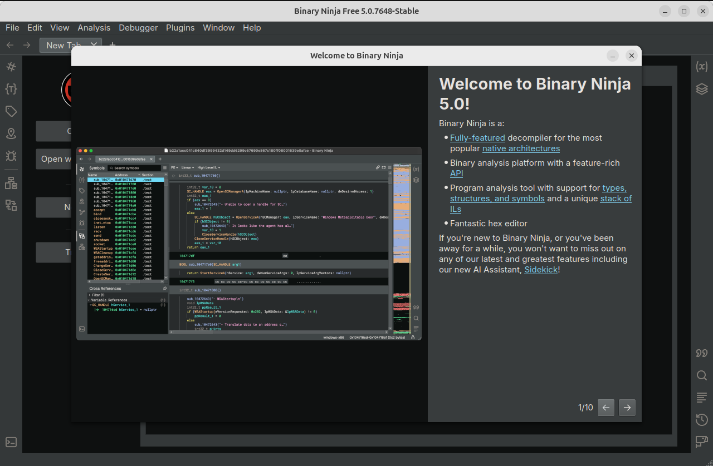
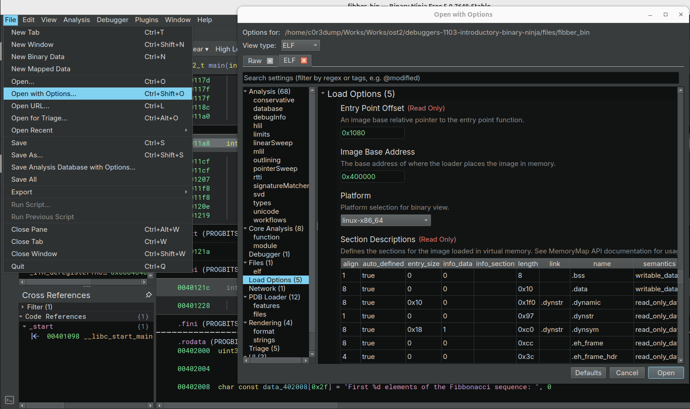

## Install Binary Ninja Free

On Ubuntu: Just download and extract



## Compiling Test Program Fibber.exe

斐波那契数列程序

- [Create Test Executable](https://ost2.fyi/Dbg1012_section2)

编译

```bash
gcc -ggdb fibber.c -o fibber_bin
```

## Loading, Configuration, Navigation

> This will open the file with the default options, which is good enough
> for the purpose of this debugger course. If, in the future you wish to
> tweak the options while opening a file, you can use “Open with
> Options…”, or right-click on a recent file and select “Open Selection
> with Options…”



> **​PDB（Program Database）文件​**​是微软推出的调试信息存储格式，主要用于记录程序的​**​符号信息​**​（如函数名、变量名、类名）、​**​源代码与二进制指令的映射关系​**​（如行号对应的内存地址），以及其他调试所需的元数据。它的核心作用是让调试器（如WinDbg）或逆向分析工具（如Binary Ninja）能够将二进制机器码“翻译”回人类可读的源代码逻辑，即使没有原始源代码也能进行有效分析。
> 
> #### Windows系统下的PDB文件
> 
> - ​**​默认生成位置​**​：如果按常规步骤在Windows编译程序（如使用MSVC编译器），编译器会生成一个与可执行文件（`.exe`）同名的`.pdb`文件，并放在同一目录下（例如`myapp.exe`对应`myapp.pdb`）。
> - ​**​Binary Ninja的自动加载​**​：Binary Ninja这类逆向工具会主动查找同目录下的`.pdb`文件。如果能找到，它会读取其中的符号信息，将二进制中的函数地址映射回原始函数名（如`main`、`login`等），而不是显示为无意义的十六进制地址（如`0x00401000`）。
> - ​**​复制到虚拟机时的注意事项​**​：如果需要将程序复制到虚拟机中分析，必须同时复制`.exe`和`.pdb`文件。缺少`.pdb`时，Binary Ninja无法获取符号信息，分析结果中的函数名会显示为乱码或哈希值，严重影响可读性。
> 
> #### Linux系统下的调试信息（ELF + DWARF）
> 
> - ​**​ELF文件​**​：Linux下的可执行文件格式是`ELF`（Executable and Linkable Format），编译后生成的二进制文件通常没有扩展名（如`myapp`）。
> - ​**​DWARF调试信息​**​：与Windows的PDB不同，Linux的调试信息（遵循`DWARF`标准）直接​**​嵌入在ELF文件内部​**​，无需额外的文件。DWARF同样记录了函数名、变量名、行号映射等信息，但所有数据都封装在`.o`目标文件或最终的可执行文件中。
> - ​**​分析时的便利性​**​：由于调试信息已嵌入ELF文件，Linux下分析二进制时（如用GDB或Binary Ninja），只要直接加载ELF文件即可获取符号信息，无需额外寻找或复制其他文件。

### Binary Ninja Default Disassembly UI

Binary Ninja is a **disassembler, decompiler, and debugger**. Unlike x64dbg or gdb, you will need to take a few steps before launching the target.

**快捷键**

- **Space bar**: Toggles between linear and graph view.

- **Escape key**: Navigate backwards to previous location.

- **G**: Go to a specific address or symbol.

- **Tab or F5**: Switch between disassembly and High Level IL (HLIL).

- **I**: Switch between disassembly and various IL levels. This works the same as the Tab key in the free version of Binary Ninja since many other IL levels are not available. In a paid version, it will cycle between disassembly - LLIL - MLIL- HLIL.

- **N**: Name a variable.

- **Y**: Change a type.

- **; (semicolon)**: Add a comment.

For more information, please refer to the [docs](https://docs.binary.ninja/getting-started.html#interacting)

> 在 ​**​Binary Ninja​**​（一款专注于二进制分析与逆向工程的工具）中，​**​IL Levels（中间语言层级）​**​ 是其核心架构的关键设计之一。它通过将原始二进制机器码转换为不同抽象层级的​**​中间语言（Intermediate Language, IL）​**​，为逆向工程师提供从底层指令细节到高层逻辑抽象的多视角分析能力。
> 
> 理解IL Levels能帮助逆向工程师更高效地使用Binary Ninja：
> 
> - ​**​快速浏览代码​**​：切换到高层IL（如“LLIL”或“HLIL”），通过控制流图和语义标签（如函数名、变量类型）快速掌握程序结构；
> - ​**​精确修改代码​**​：切换到底层IL（如“MLIL”或“Disassembly”），直接编辑指令的操作数或控制流，实现补丁注入；
> - ​**​自动化分析​**​：利用高层IL的语义信息（如类型推断）编写脚本，批量检测漏洞（如缓冲区溢出）或提取敏感数据。

### EXERCISE

- Open the Fibber executable in Binary Ninja and try the different ways to navigate around:
1. Double-click a function to navigate to it.

2. Press G and then type in an address or a symbol name to navigate to it.

3. Find a string, and follow its cross-references to navigate to the code that uses it.
- Open a disassembly and HLIL view side-by-side. Compare the disassembly instructions and HLIL decompiler output.

> ffmpeg转换：将Ubuntu默认录屏文件格式webm转为gif文件
> 
> - https://yuanbao.tencent.com/bot/app/share/chat/jETNnfr0Oh4N
> 
> ```bash
> ffmpeg -i 2025-07-22-13-25-52.webm   -filter_complex "[0:v]fps=10,scale=640:-1,palettegen=max_colors=256:stats_mode=diff[out_palette]; \
>                    [0:v][out_palette]paletteuse=dither=floyd_steinberg:bayer_scale=5[out_gif]"   -map "[out_gif]"   output_medium_quality.gif
> ```


## Debugger Intro

> As you can see in the video, the Binary Ninja debugger’s Windows backend is built on top of **DbgEng**, the same engine used by **WinDbg**. This means if you’re already familiar with WinDbg, you can interact with the debugger using the exact WinDbg commands in the Debugger console at the bottom of the window. Similarly, on Linux, the debugger uses LLDB as its
> backend, allowing you to issue LLDB commands directly. This gives you
> the flexibility to combine Binary Ninja’s modern UI with the full power
> of the underlying native debugger.
> 
> For a list of commonly used commands and usage examples, refer to the Binary Ninja Debugger [documentation](https://docs.binary.ninja/guide/debugger/index.html#running-debug-adapter-backend-commands). (Other parts of the debugger documentation are worth checking out too!) If you wish to dig into WinDbg/LLDB usage more, feel free to check out their respective documentations or online resources.
> 
> Also, the Binary Ninja debugger is fully open-source and [available](https://github.com/Vector35/debugger) on GitHub, so if you’re curious about how things work under the hood or
> have a bug to report or a feature to suggest, feel free to browse the
> codebase or open an issue.

### EXERCISE

- Launch the Fibber under the debugger.
1. Observe the buttons in the debugger sidebar become usable.

2. Examine the registers and their values.

3. Examine the debugger modules.

4. Examine the stack trace.

5. Run a debugger backend command in the “Debugger” console and observe its output.

6. Click “Menu - Debugger - Create Stack View” and examine the bytes around the stack pointer.


## Working with Breakpoints
