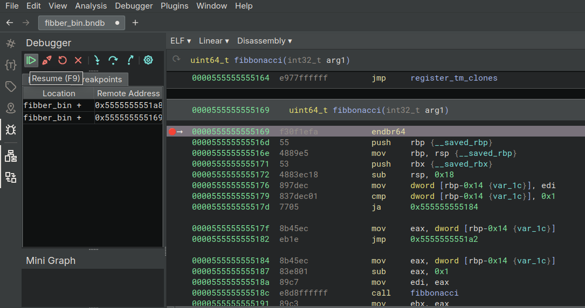
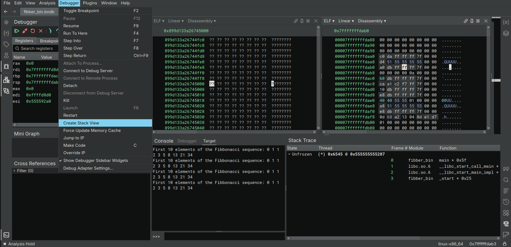
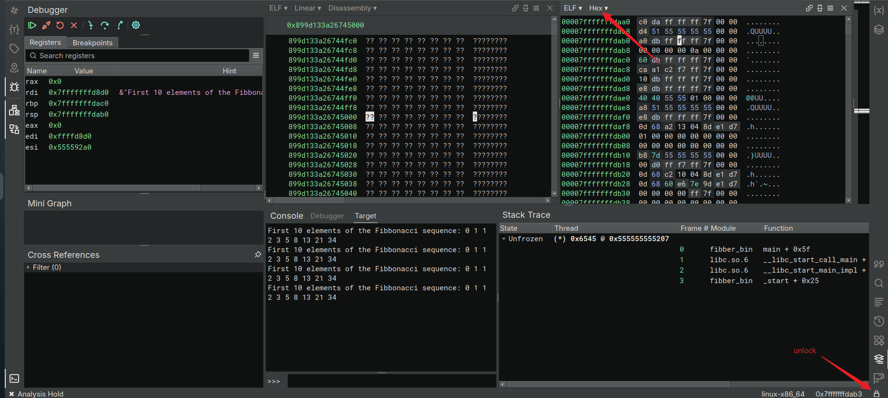

## Install Binary Ninja Free

On Ubuntu: Just download and extract


## Compiling Test Program Fibber.exe

斐波那契数列程序

- [Create Test Executable](https://ost2.fyi/Dbg1012_section2)

编译

```bash
gcc -ggdb fibber.c -o fibber_bin
```

## Loading, Configuration, Navigation

> This will open the file with the default options, which is good enough
> for the purpose of this debugger course. If, in the future you wish to
> tweak the options while opening a file, you can use “Open with
> Options…”, or right-click on a recent file and select “Open Selection
> with Options…”


> **​PDB（Program Database）文件​**​是微软推出的调试信息存储格式，主要用于记录程序的​**​符号信息​**​（如函数名、变量名、类名）、​**​源代码与二进制指令的映射关系​**​（如行号对应的内存地址），以及其他调试所需的元数据。它的核心作用是让调试器（如WinDbg）或逆向分析工具（如Binary Ninja）能够将二进制机器码“翻译”回人类可读的源代码逻辑，即使没有原始源代码也能进行有效分析。
>
> #### Windows系统下的PDB文件
>
> - ​**​默认生成位置​**​：如果按常规步骤在Windows编译程序（如使用MSVC编译器），编译器会生成一个与可执行文件（`.exe`）同名的`.pdb`文件，并放在同一目录下（例如`myapp.exe`对应`myapp.pdb`）。
> - ​**​Binary Ninja的自动加载​**​：Binary Ninja这类逆向工具会主动查找同目录下的`.pdb`文件。如果能找到，它会读取其中的符号信息，将二进制中的函数地址映射回原始函数名（如`main`、`login`等），而不是显示为无意义的十六进制地址（如`0x00401000`）。
> - ​**​复制到虚拟机时的注意事项​**​：如果需要将程序复制到虚拟机中分析，必须同时复制`.exe`和`.pdb`文件。缺少`.pdb`时，Binary Ninja无法获取符号信息，分析结果中的函数名会显示为乱码或哈希值，严重影响可读性。
>
> #### Linux系统下的调试信息（ELF + DWARF）
>
> - ​**​ELF文件​**​：Linux下的可执行文件格式是`ELF`（Executable and Linkable Format），编译后生成的二进制文件通常没有扩展名（如`myapp`）。
> - ​**​DWARF调试信息​**​：与Windows的PDB不同，Linux的调试信息（遵循`DWARF`标准）直接​**​嵌入在ELF文件内部​**​，无需额外的文件。DWARF同样记录了函数名、变量名、行号映射等信息，但所有数据都封装在`.o`目标文件或最终的可执行文件中。
> - ​**​分析时的便利性​**​：由于调试信息已嵌入ELF文件，Linux下分析二进制时（如用GDB或Binary Ninja），只要直接加载ELF文件即可获取符号信息，无需额外寻找或复制其他文件。

### Binary Ninja Default Disassembly UI

Binary Ninja is a **disassembler, decompiler, and debugger**. Unlike x64dbg or gdb, you will need to take a few steps before launching the target.

**快捷键**

- **Space bar**: Toggles between linear and graph view.

- **Escape key**: Navigate backwards to previous location.

- **G**: Go to a specific address or symbol.

- **Tab or F5**: Switch between disassembly and High Level IL (HLIL).

- **I**: Switch between disassembly and various IL levels. This works the same as the Tab key in the free version of Binary Ninja since many other IL levels are not available. In a paid version, it will cycle between disassembly - LLIL - MLIL- HLIL.

- **N**: Name a variable.

- **Y**: Change a type.

- **; (semicolon)**: Add a comment.

For more information, please refer to the [docs](https://docs.binary.ninja/getting-started.html#interacting)

> 在 ​**​Binary Ninja​**​（一款专注于二进制分析与逆向工程的工具）中，​**​IL Levels（中间语言层级）​**​ 是其核心架构的关键设计之一。它通过将原始二进制机器码转换为不同抽象层级的​**​中间语言（Intermediate Language, IL）​**​，为逆向工程师提供从底层指令细节到高层逻辑抽象的多视角分析能力。
>
> 理解IL Levels能帮助逆向工程师更高效地使用Binary Ninja：
>
> - ​**​快速浏览代码​**​：切换到高层IL（如“LLIL”或“HLIL”），通过控制流图和语义标签（如函数名、变量类型）快速掌握程序结构；
> - ​**​精确修改代码​**​：切换到底层IL（如“MLIL”或“Disassembly”），直接编辑指令的操作数或控制流，实现补丁注入；
> - ​**​自动化分析​**​：利用高层IL的语义信息（如类型推断）编写脚本，批量检测漏洞（如缓冲区溢出）或提取敏感数据。

### EXERCISE

- Open the Fibber executable in Binary Ninja and try the different ways to navigate around:

1. Double-click a function to navigate to it.

2. Press G and then type in an address or a symbol name to navigate to it.

3. Find a string, and follow its cross-references to navigate to the code that uses it.

- Open a disassembly and HLIL view side-by-side. Compare the disassembly instructions and HLIL decompiler output.

> ffmpeg转换：将Ubuntu默认录屏文件格式webm转为gif文件
>
> - https://yuanbao.tencent.com/bot/app/share/chat/jETNnfr0Oh4N
>
> ```bash
> ffmpeg -i 2025-07-22-13-25-52.webm   -filter_complex "[0:v]fps=10,scale=640:-1,palettegen=max_colors=256:stats_mode=diff[out_palette]; \
>                    [0:v][out_palette]paletteuse=dither=floyd_steinberg:bayer_scale=5[out_gif]"   -map "[out_gif]"   output_medium_quality.gif
> ```


## Debugger Intro

> As you can see in the video, the Binary Ninja debugger’s Windows backend is built on top of **DbgEng**, the same engine used by **WinDbg**. This means if you’re already familiar with WinDbg, you can interact with the debugger using the exact WinDbg commands in the Debugger console at the bottom of the window. Similarly, on Linux, the debugger uses LLDB as its
> backend, allowing you to issue LLDB commands directly. This gives you
> the flexibility to combine Binary Ninja’s modern UI with the full power
> of the underlying native debugger.
>
> For a list of commonly used commands and usage examples, refer to the Binary Ninja Debugger [documentation](https://docs.binary.ninja/guide/debugger/index.html#running-debug-adapter-backend-commands). (Other parts of the debugger documentation are worth checking out too!) If you wish to dig into WinDbg/LLDB usage more, feel free to check out their respective documentations or online resources.
>
> Also, the Binary Ninja debugger is fully open-source and [available](https://github.com/Vector35/debugger) on GitHub, so if you’re curious about how things work under the hood or
> have a bug to report or a feature to suggest, feel free to browse the
> codebase or open an issue.

### EXERCISE

- Launch the Fibber under the debugger.

1. Observe the buttons in the debugger sidebar become usable.

2. Examine the registers and their values.

3. Examine the debugger modules.

4. Examine the stack trace.

5. Run a debugger backend command in the “Debugger” console and observe its output.

6. Click “Menu - Debugger - Create Stack View” and examine the bytes around the stack pointer.


## Working with Breakpoints

添加breakpoints: F2或者右键添加

**EXERCISE**

- Basic operation with breakpoint:

1. Set a breakpoint on the first assembly instruction of the function `main()`.

2. Click the “Resume” button in the debugger sidebar.

3. Observe the breakpoint hits at `main()`.

- Breakpoint in recursive functions.

1. Put a breakpoint at the start of the `fibonacci` function.

2. Resume the target, wait for the breakpoint to hit.

3. Open the stack trace and see how the execution reached the point.

4. Resume the target a few more times, and see how the stack trace change. Explain what you see (remember the `fibonacci` is a recursive function, so it calls itself.)



### Hardware/Data Access Breakpoints

**硬件断点**对于调试非常有用。有两种主要类型的硬件断点-硬件执行断点和硬件读/写断点。后者通常也被称为“数据访问断点”。数据访问断点不是在代码地址上放置（软件）断点，而是在读取或写入特定地址处的数据时触发。这有助于定位对某些给定数据进行操作的代码。

Binary Ninja调试器还没有内置对硬件/数据访问断点的支持。然而，由于认识到其重要性，添加它的功能请求在https://github.com/Vector35/debugger/issues/53中被跟踪并被赋予高优先级。同时，由于Binary Ninja调试器使用WinDbg/LLDB作为调试引擎，您仍然可以通过运行后端命令添加这些断点。

英特尔对“硬件”断点和“软件”断点有不同的概念。通常可以设置无限数量的软件断点，因为它们采用单字节“中断3”（0xCC）指令的形式，调试器将其写入指令流中任何想要中断的地方。当中断发生时，它最终会返回到调试器，调试器可以更新其元数据，以了解在何处触发了什么断点，重写指令流，以便可以执行原始指令，为人类更新UI，并允许执行继续。

**Intel CPU说明**

Intel提供了4个专用的调试寄存器（通常指DR0-DR3，配合DR7控制寄存器），其核心作用是​**​通知内存管理单元（MMU）监控特定内存地址或IO端口的访问行为​**​。MMU作为CPU管理内存访问的核心组件，会根据这些寄存器的配置，在程序访问目标地址时触发断点（中断），并将控制权交给调试器。

传统软件断点（如通过`int 3`指令）需要修改目标内存处的指令（将其替换为陷阱指令），因此​**​要求目标地址必须已被映射到程序的内存空间​**​（即物理内存已分配且虚拟地址有效）。而硬件执行断点（通过调试寄存器设置）的优势在于：

- ​**​无需目标地址预先映射​**​：即使目标内存尚未被程序加载（如动态分配的内存、延迟加载的代码段），只要预先知道其未来的虚拟地址，就可以提前设置断点。当MMU将该虚拟地址映射到物理内存后，CPU访问该地址时，硬件会自动触发断点，通知调试器。

### // Shellcode注入检测

调试器可预先分析恶意软件的行为模式（如通过沙箱记录其常用的内存分配函数调用链），推断出Shellcode可能被写入的​**​虚拟地址范围​**​（例如`0x0000000140000000`到`0x0000000140FFFFFF`的用户模式可执行区域）。然后，在调试阶段针对该范围内的所有可能地址（或关键偏移）设置硬件执行断点（通过DR0-DR3寄存器）。当Shellcode被写入并执行时，CPU访问该地址触发断点，调试器接管控制流，此时可dump内存中的Shellcode进行分析，或修改其指令阻止执行。

## Stepping Through Assembly

**Step Over**: 单步执行调用指令(call instructions)-执行其中的所有指令，但不将调试器UI显示为停止，**直到到达调用指令之后的指令**

**Step Into**: 单步执行call instructions

**Step Return**: 在Binary Ninja中，“step return”（也称为“step out”）将一直运行，**直到执行从当前函数返回**

## Examine & Modify Registers & Memory

> Please be aware that when the target is running, you will be seeing potentially outdated values, in other words, these values are only reliable when the target has stopped (either at a breakpoint, or manually interrupted by the user).

观测内存



修改内存



### EXERCISE

1. Find a **register** that is used in the **main** function. Change its value and resume the execution. How does it affect the later execution? (It may crash the program, but that is fine!)

2. Patch the string “First %d elements of the Fibonacci sequence: " in memory, and observe it changes the output printed to the console.

3. Restart the debugger and observe that the patches you made to the memory during debugging is lost – that is because **you only changed it when it is “live”, and the file on disk is not changed.**

4. If you wish the changes to persist. You need to save the changes to a new file. You can do so by
   1. stop debugging
   2. modify the string as you see fit
   3. Click Menu -> File -> Save As, and check “Save file contents only”, and then choose a location to save it. After that, when you run the program, you can see it always displays the altered string.

> 如下使用`video`标签进行视频插入

<html>
<video src="/home/c0r3dump/Works/Works/ost2/debuggers-1103-introductory-binary-ninja//assets/view-memory.webm" controls width="640" height="360">
不支持video标签
</video>
</html>

## Attaching to Running Userspace Processes

Why?: 一些场景

> There are some tradeoffs, too. Since we are starting debugging later, we
> lose the opportunity to **observe the target in its early running stages**.

- 调试一些复杂的二进制程序，通过脚本来启动

- 调试系统服务

### Ptrace && Yama安全機制

> 在 Linux 系统中，`ptrace` 是一个关键的系统调用，用于​**​进程调试​**​（如 `gdb` 调试器依赖它）。它允许一个进程（调试器）观察、控制甚至修改另一个进程（被调试进程）的内存、寄存器、执行流程等。
>
> Linux 引入了 ​**​Yama 项目​**​（一组增强系统安全的补丁），其中通过 `kernel.yama.ptrace_scope` 参数限制了 `ptrace` 的使用范围。
>
> `kernel.yama.ptrace_scope` 控制 `ptrace` 的“作用域”，决定哪些用户可以调试其他进程。其取值通常为：
>
> - ​**​0​**​：完全禁用 Yama 限制（不推荐）。任何用户（包括非特权用户）都可以用 `ptrace` 附加到任意进程（包括其他用户的进程）。
> - ​**​1​**​（默认值，多数 Linux 发行版）：仅允许调试器进程的所有者与被调试进程的所有者相同，或调试器以 `root` 权限运行时，才能附加到目标进程。
> - ​**​2​**​：更严格的限制（部分系统支持），仅允许 `root` 使用 `ptrace` 附加到其他进程。

```bash
c0r3dump@Ubuntu24:~/Works/Works/ost2/debuggers-1103-introductory-binary-ninja/files$ sysctl kernel.yama.ptrace_scope
kernel.yama.ptrace_scope = 1
c0r3dump@Ubuntu24:~/Works/Works/ost2/debuggers-1103-introductory-binary-ninja/files$ sudo sysctl kernel.yama.ptrace_scope=0
[sudo] password for c0r3dump:
kernel.yama.ptrace_scope = 0
c0r3dump@Ubuntu24:~/Works/Works/ost2/debuggers-1103-introductory-binary-ninja/files$ sysctl kernel.yama.ptrace_scope
kernel.yama.ptrace_scope = 0
```

### Debugging without opening the binary first

> In Binary Ninja debugger, you do not have to open the binary first when you wish to debug it. You can start debugging right away. To do so, first create an empty binary view with the correct architecture and platform, by clicking `“File” -> “New Mapped Data”, and select “x86_64” as the Architecture, “windows” as the Operating system, then click “Accept”.` If you are debugging on a different architecture/operating system, select the right one accordingly.


## Complete!

If your Progress page shows a grade of >= 97% then you’re now eligible to join the “Dbg1103 Alumni” Slack channel! The channel is meant to be a low-noise channel for students to be able to keep in touch with the instructor, seek/advertise jobs that use the skills you learned in the class, make suggestions for future class content, etc. To join, email dbg1103@ost2.fyi with a subject line of “dbg1103 alumni join” and you will receive an invite.

Certificate:

[OpenSecurityTraining2 Dbg1103 Certificate | OpenSecurityTraining2](https://p.ost2.fyi/certificates/748d29a3280d4efb8d4f1c2133d6fd31)
